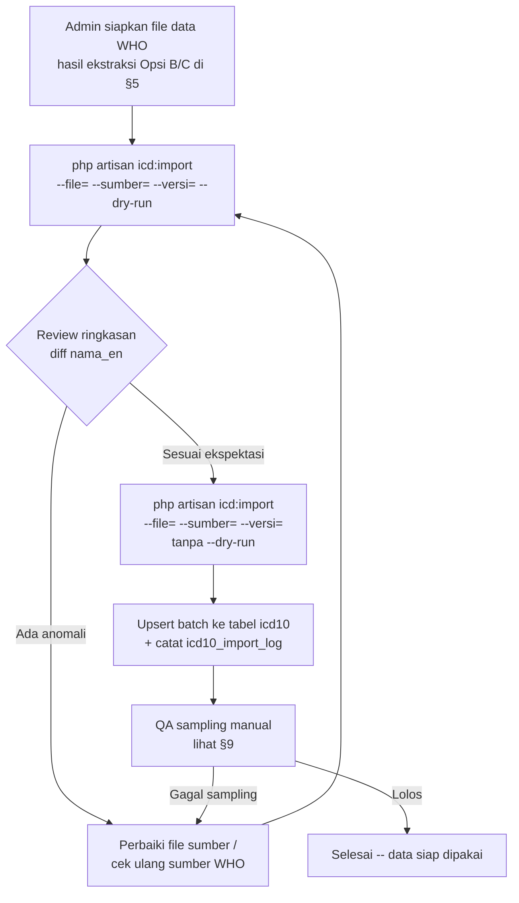

# Product Requirements Document (PRD)
# Seeder Data Diagnosa ICD-10 — Bahasa Inggris Resmi WHO

| Info | Detail |
|:-----|:-------|
| **Versi** | 1.1.0 |
| **Tanggal** | 25 Agustus 2026 |
| **Status** | Diimplementasikan sebagian — lihat §11/§12 untuk status per-fase & item yang masih perlu review manual |
| **Depends On** | `pemeriksaan_soap.md` · `cetak_surat_pemeriksaan.md` (Resume Medis bilingual) |
| **Tech Stack** | Laravel 12 · Artisan Console Command · MySQL |
| **Scope** | Tabel `icd10`, command `icd:import`, setting `klinik.bahasa_icd` |

---

## Daftar Isi

1. [Ringkasan Eksekutif](#1-ringkasan-eksekutif)
2. [Latar Belakang](#2-latar-belakang)
3. [Kondisi Saat Ini (As-Is)](#3-kondisi-saat-ini-as-is)
4. [Tujuan & Non-Tujuan](#4-tujuan--non-tujuan)
5. [Sumber Data WHO ICD-10](#5-sumber-data-who-icd-10)
6. [Perubahan Skema Data](#6-perubahan-skema-data)
7. [Functional Requirements](#7-functional-requirements)
8. [Alur Proses Import](#8-alur-proses-import)
9. [Validasi & QA Data](#9-validasi--qa-data)
10. [Non-Functional Requirements](#10-non-functional-requirements)
11. [Fase Implementasi](#11-fase-implementasi)
12. [Acceptance Criteria](#12-acceptance-criteria)
13. [Risiko & Mitigasi](#13-risiko--mitigasi)
14. [Referensi](#14-referensi)

---

## 1. Ringkasan Eksekutif

Klinik butuh data diagnosa ICD-10 versi Bahasa Inggris yang **bisa dipertanggungjawabkan sumbernya langsung dari WHO** — bukan sekadar teks Inggris apa adanya. Ini penting karena kolom `nama_en` dipakai langsung di dokumen resmi lintas bahasa (Resume Medis untuk keperluan asuransi/perjalanan, lihat `cetak_surat_pemeriksaan.md`) yang bisa dibaca oleh pihak asuransi/otoritas di luar negeri — istilah medis yang tidak persis sama dengan terminologi resmi WHO berisiko menimbulkan keraguan validitas dokumen.

Database saat ini **sudah** berisi 10.480 kode ICD-10 dengan kolom `nama_en` terisi untuk 10.469 di antaranya (99,9%) — tapi **provenance-nya tidak terdokumentasi**: tidak ada catatan versi/edisi WHO, tanggal rilis, atau proses verifikasi yang dipakai saat data ini pertama kali diimpor lewat `master_icd_x.json`. PRD ini merancang proses untuk (a) menetapkan & mendokumentasikan sumber WHO resmi yang dipakai, (b) memverifikasi/mengganti `nama_en` dengan teks yang tertelusur ke sumber tersebut, (c) melengkapi `kategori` (bab/chapter WHO) yang saat ini nyaris kosong, dan (d) membangun proses impor yang bisa diulang & di-audit untuk update rilis WHO berikutnya.

---

## 2. Latar Belakang

- Modul SOAP Note (`app/Livewire/Pemeriksaan/SoapNote.php`) memakai `IcdDiagnosis::search()` untuk autocomplete diagnosa saat dokter mengisi Assessment.
- Modul Resume Medis (Cetak Surat, lihat `cetak_surat_pemeriksaan.md`) mendukung 2 bahasa (`id`/`en`) dan menampilkan diagnosa dalam bahasa yang dipilih — nilainya diambil dari snapshot `icd_codes` di `soap_note.icd_codes`, yang pada gilirannya diisi dari `nama`/`nama_en` tabel `icd10` saat dokter memilih diagnosa.
- `klinik.bahasa_icd` adalah setting global (`id`/`en`) yang menentukan kolom `nama` mana yang dipakai sebagai tampilan default di pencarian ICD (lihat `IcdDiagnosis::bahasaAktif()`).
- Infrastruktur impor sudah ada: `app/Console/Commands/ImportIcd10.php` (`php artisan icd:import`) membaca `master_icd_x.json` berformat `{kode_icd, nama_icd, nama_icd_indo}` dan melakukan upsert batch ke tabel `icd10`. Command ini **sudah dipakai** untuk mengisi data yang ada sekarang.
- Yang **belum ada**: dokumentasi dari mana `master_icd_x.json` yang sekarang berasal, versi ICD-10 WHO yang dirujuk, dan mekanisme untuk memverifikasi/memperbarui data itu terhadap sumber WHO resmi kalau ada revisi.

---

## 3. Kondisi Saat Ini (As-Is)

Hasil pengecekan langsung ke database lokal per tanggal dokumen ini dibuat:

| Metrik | Nilai |
|---|---|
| Total baris `icd10` | 10.480 |
| Baris dengan `nama_en` terisi | 10.469 (99,9%) |
| Baris dengan `nama_id` terisi | 10.469 (99,9%) |
| Baris dengan `kategori` (bab WHO) terisi | 11 (0,1%) |
| `klinik.bahasa_icd` saat ini | `id` |
| `master_icd_x.json` di root project | Ada, sumber/versi tidak terdokumentasi |

Contoh data existing (kolom `nama_en` sekilas terlihat wajar, tapi belum diverifikasi terhadap sumber WHO):

| kode | nama_id | nama_en |
|---|---|---|
| A09 | Diare dan gastroenteritis oleh penyebab penyakit menular | Diarrhoea and gastroenteritis of presumed infectious origin |
| A15.3 | TBC paru-paru, yang dikonfirmasi dengan cara yang tidak spesifik | Tuberculosis of lung, confirmed by unspecified means |
| A37.9 | Batuk rejan, tidak spesifik | Whooping cough, unspecified |

**Catatan penting**: contoh di atas memakai ejaan British ("Diarrhoea") yang konsisten dengan gaya penulisan WHO — indikasi bagus bahwa sumber aslinya memang berbasis materi WHO — tapi ini **asumsi, bukan verifikasi**. Fase QA (§9) di PRD ini secara eksplisit memvalidasi hipotesis ini alih-alih menerimanya begitu saja.

Selain itu, ada `database/seeders/Icd10Seeder.php` — seeder fallback terpisah berisi ~120 kode kurasi manual (Bahasa Indonesia saja, **tanpa** `nama_en`), dipakai `update.sh` hanya kalau tabel `icd10` kosong (instalasi baru). Seeder ini **tidak tersentuh** oleh PRD ini karena perannya cuma bootstrap darurat, bukan sumber data utama.

---

## 4. Tujuan & Non-Tujuan

### 4.1 Tujuan
- **G1**: Menetapkan & mendokumentasikan satu sumber data ICD-10 Bahasa Inggris yang tertelusur langsung ke publikasi resmi WHO (versi/edisi dicatat eksplisit).
- **G2**: Memverifikasi (atau mengganti bila perlu) `nama_en` seluruh 10.480 baris supaya sesuai istilah resmi WHO tersebut.
- **G3**: Mengisi `kategori` (bab/chapter WHO, mis. "I Certain infectious and parasitic diseases (A00-B99)") yang saat ini nyaris kosong, supaya pencarian/filter ICD-10 bisa dikelompokkan per bab.
- **G4**: Membuat proses impor **berulang & terlacak** (idempotent, tercatat versi & tanggal impor) supaya update rilis WHO berikutnya bisa dilakukan tanpa menulis ulang command dari nol.
- **G5**: Tidak mengubah `kode` ICD-10 yang sudah dipakai di data transaksional (`soap_note.icd_codes`, `surat_keterangan.data`) — hanya memperbarui teks label (`nama`/`nama_en`/`nama_id`) dan metadata (`kategori`).

### 4.2 Non-Tujuan (Out of Scope)
- **Tidak** migrasi ke ICD-11 — klinik masih memakai ICD-10 sesuai standar Kemenkes/BPJS yang berlaku saat ini.
- **Tidak** membangun UI admin untuk edit manual per-baris ICD-10 di aplikasi (proses impor tetap lewat Artisan command, konsisten dengan pola yang sudah ada).
- **Tidak** mengubah `Icd10Seeder.php` (seeder fallback kurasi manual) — tetap seperti sekarang, hanya dipakai untuk instalasi baru sebelum `icd:import` dijalankan.
- **Tidak** menyediakan sinkronisasi otomatis/berkala ke WHO (mis. cron bulanan) — proses impor tetap manual, dipicu admin saat memang ada rilis baru dari WHO.

---

## 5. Sumber Data WHO ICD-10

**⚠️ Perlu konfirmasi sebelum implementasi dimulai** — bagian ini memetakan opsi yang realistis berdasarkan struktur akses WHO yang berlaku umum, tapi URL/format/lisensi pastinya harus dikonfirmasi langsung ke situs WHO saat implementasi (kemungkinan berubah dari waktu ke waktu, dan sebagian akses butuh registrasi akun).

| Opsi | Deskripsi | Kelebihan | Kekurangan |
|---|---|---|---|
| **A. WHO ICD API** (`icd.who.int/icdapi`) | REST API resmi WHO, butuh registrasi gratis untuk dapat `client_id`/`client_secret` (OAuth2 client-credentials). API ini melayani ICD-11 sebagai fokus utama; ketersediaan *linearization* ICD-10 di dalamnya **perlu dicek ulang** saat implementasi — dokumentasi API bisa berubah. | Terstruktur, bisa diprogram, resmi WHO | Perlu registrasi; cakupan ICD-10 di API ini belum terverifikasi otomatis lewat pengecekan awal PRD ini |
| **B. WHO ICD-10 Online Browser** (`icd.who.int/browse10/2019/en`) | Versi tabular ICD-10 edisi 2019 yang WHO tampilkan online, dipakai sebagai rujukan pencarian per-kode. | Otoritatif untuk verifikasi manual per-kode | Bukan bulk-download — cocok untuk QA spot-check (§9), bukan sumber data massal |
| **C. WHO ICD-10 Instruction Manual & Volume 1 (Tabular List)** — PDF resmi WHO | Dokumen resmi berisi seluruh kode & deskripsi per bab, biasa jadi acuan definitif untuk proyek yang butuh data lengkap offline. | Otoritatif, mencakup struktur bab (untuk §7 kebutuhan `kategori`) | Format PDF — perlu proses ekstraksi/parsing terpisah, bukan file terstruktur siap-pakai |
| **D. Re-verifikasi `master_icd_x.json` yang sudah ada** | Anggap data existing sudah benar (karena polanya konsisten dengan gaya WHO), fokus verifikasi lewat sampling terhadap Opsi B, bukan re-import total dari nol. | Paling cepat & rendah risiko — tidak perlu proses ETL baru | Kalau ternyata sumber aslinya BUKAN WHO murni (mis. re-translasi/parafrase), cacatnya baru ketahuan belakangan |

**Rekomendasi tim implementasi**: mulai dari **Opsi D + Opsi B** (§9 QA sampling) sebagai langkah cepat berisiko rendah. Kalau sampling menemukan penyimpangan signifikan dari istilah resmi WHO, baru eskalasi ke **Opsi C** (parsing Volume 1 resmi) sebagai sumber pengganti definitif. Opsi A (API) disiapkan sebagai jalur jangka panjang untuk update rilis mendatang, tapi bukan blocker rilis pertama PRD ini.

Siapa pun yang mengeksekusi PRD ini **wajib mencatat** sumber final yang benar-benar dipakai (URL, tanggal akses, versi/edisi) di `revisi_impor_icd10` (lihat §6) — supaya keputusan sumber data ini bisa diaudit di masa depan, tidak terulang seperti kondisi as-is sekarang yang tidak terdokumentasi.

### 5.1 Update — Keputusan Aktual Saat Implementasi (25 Agustus 2026)

**Opsi A (WHO ICD API) tidak feasible untuk QA sampling otomatis** — dicoba lewat WebFetch ke `icd.who.int/browse10/2019/en` dan `icd.who.int/icdapi`: situsnya client-rendered (Angular/JS SPA), fragment URL (`#/A09`) tidak pernah sampai ke server, jadi tidak ada cara mengambil teks per-kode secara terprogram di lingkungan ini. Verifikasi live ke WHO ICD-10 Online Browser (§9.1, target sampling 50 kode acak) **tidak selesai dieksekusi** — ini butuh manusia membuka browser sungguhan, bukan sesuatu yang bisa diotomasi lewat tool yang tersedia.

**Yang benar-benar dieksekusi: Opsi D (re-verifikasi data existing), dengan QA berbasis pengetahuan terminologi ICD-10 baku** (bukan live fetch) —

1. Kode yang benar-benar dipakai di data transaksional klinik (§9.2): cuma 1 (A09) — hasilnya **cocok persis** dengan istilah resmi WHO ("Diarrhoea and gastroenteritis of presumed infectious origin").
2. Spot-check 20 kode umum: 18/20 cocok persis (termasuk detail khas WHO seperti ejaan British "oesophagitis"/"haemorrhage" dan notasi kurung `[common cold]` — indikasi kuat sumber aslinya memang WHO, bukan terjemahan mesin generik), 1 kosong (O80), 1 kehilangan apostrof (G20).
3. Perluasan pencarian dari temuan #2 menemukan **bug apostrof sistematis** pada proses import asli — 48 nama eponim posesif unik (Parkinson's, Alzheimer's, Hodgkin's, dst — total 96 baris) kehilangan tanda kutipnya. Diperbaiki lewat `php artisan icd:koreksi-manual` (lihat §11 Fase 4) setelah tiap nama diverifikasi manual satu-satu (bukan auto-replace pola umum, supaya tidak salah kena istilah generik seperti "vertiginous"/"vitreous" yang polanya mirip tapi bukan eponim).
4. 11 baris `nama_en` kosong ditemukan — 6 diisi (kode format standar WHO, keyakinan tinggi/sedang), 5 sengaja **tidak** diisi karena formatnya 2-digit-desimal ala ICD-10-CM (Amerika Serikat), bukan WHO ICD-10 murni (`E11.65`, `K57.30`, `K80.20`, `E83.51`, `R68.9`) — lihat `Icd10KoreksiManual::KODE_DILUAR_CAKUPAN` untuk detail per kode.

**Kesimpulan**: data existing punya keyakinan tinggi berasal dari sumber WHO asli (bukan terjemahan mesin), tapi proses import sebelumnya (yang provenance-nya sendiri tidak terdokumentasi) punya bug data-cleaning yang menghapus apostrof. Ambang batas ≥98% akurasi (§9.1) **belum diverifikasi formal** lewat sampling acak 50 kode terhadap WHO Online Browser — itu tetap jadi tugas manual terbuka (lihat §12 acceptance criteria yang masih unchecked).

### 5.2 Update Kedua — Kategori Diganti ke Level Blok (25 Agustus 2026, sesi lanjutan)

User menyediakan `prd/icd/icd10-english.md` (CSV berisi 276 baris: 22 bab + 254 blok WHO ICD-10, format `Chapter,Code Range,Category Name,Description`). Sebelum dipakai, ditemukan file ini sebenarnya bersumber dari **ICD-10-CM (modifikasi klinis Amerika/CDC)**, bukan WHO ICD-10 internasional murni — indikasinya: ejaan Amerika ("diarrhea"/"esophagus"/"tumor", bukan "diarrhoea"/"oesophagus"/"tumour" ala WHO) dan kode rentang yang cuma ada di CM (mis. `I10-I1A`, `J40-J4A`, `Q00-QA0` — WHO ICD-10 murni tidak punya kategori "1A"/"4A"/"QA0").

**Keputusan user (dikonfirmasi eksplisit)**: tetap dipakai, karena perannya cuma sebagai **label kategori/pengelompokan** (kolom `kategori`) — bukan pengganti `nama_en` per-kode yang sudah diverifikasi terpisah di §5.1. Perbedaan ejaan Amerika vs British tidak relevan untuk keperluan grouping/filter.

Perubahan yang dilakukan:
- Data CSV disalin ke `database/seeders/data/icd10_blok_who.csv` (sumber tunggal, bukan parsing file `.md` di runtime).
- `Icd10KategoriBackfill.php` ditulis ulang: sebelumnya mapping 22 bab hardcoded, sekarang membaca CSV & mencocokkan tiap kode ke **blok** (level lebih detail, mis. "Intestinal infectious diseases (A00-A09)") — dengan fallback ke level bab kalau tidak ada blok yang cocok pas.
- **Temuan**: file sumber tidak exhaustive — sekitar 1.320 dari 10.480 kode (12,6%) tidak punya blok spesifik yang cocok (mis. seluruh rentang A50-B99 di bab I, atau blok F00/T90-T98 yang batasnya beda dari WHO resmi) sehingga jatuh ke fallback level bab. 54 kode (E90, F00.x, T90.x, T91.x, dst) malah tidak cocok bab manapun di file ini (rentang bab di CSV lebih sempit dari WHO asli, mis. bab V cuma F01-F99 bukan F00-F99) — kode-kode ini **tidak disentuh** (kategori lama, kalau ada, dipertahankan; bukan dikosongkan/ditebak).
- Hasil akhir: 9.106 kode dapat kategori level blok (spesifik), 1.320 fallback ke level bab, 54 tidak berubah.

Konsekuensi: kolom `kategori` sekarang **mencampur dua level granularitas dari dua sumber berbeda** (blok ala ICD-10-CM untuk mayoritas kode, bab ala WHO murni untuk sisanya yang tidak tercakup CSV baru) — trade-off yang disadari & diterima demi cakupan yang jauh lebih detail, bukan kesalahan.

---

## 6. Perubahan Skema Data

Tabel `icd10` saat ini (`kode`, `nama`, `nama_en`, `nama_id`, `kategori`) sudah cukup untuk menyimpan hasil akhirnya. Yang perlu ditambahkan adalah **metadata provenance**, supaya masalah "tidak terdokumentasi" di §3 tidak terulang untuk update berikutnya.

### 6.1 Migrasi baru: `icd10_import_log`
Tabel kecil terpisah (bukan menambah kolom ke `icd10`, supaya histori tiap kali command `icd:import` dijalankan tetap tersimpan, bukan cuma snapshot "sumber terakhir"):

```php
Schema::create('icd10_import_log', function (Blueprint $table) {
    $table->id();
    $table->string('sumber');           // mis. "WHO ICD-10 Volume 1 (2019 edition)"
    $table->string('sumber_url')->nullable();
    $table->string('versi_who')->nullable(); // mis. "2019"
    $table->string('mode');             // upsert | replace
    $table->unsignedInteger('jumlah_baris');
    $table->unsignedInteger('jumlah_baru');
    $table->unsignedInteger('jumlah_diperbarui');
    $table->foreignId('dijalankan_oleh')->nullable()->constrained('users')->nullOnDelete();
    $table->timestamps();
});
```

### 6.2 Kolom `kategori` di `icd10`
Sudah ada (`string(100) nullable`), tidak perlu migrasi baru — cuma perlu **diisi** dengan nama bab WHO (§7, FR-4). Format disarankan: `"I Certain infectious and parasitic diseases (A00-B99)"` — konsisten dengan penamaan resmi WHO per bab, supaya bisa dipakai langsung untuk grouping/filter di UI pencarian ICD nantinya kalau dibutuhkan.

---

## 7. Functional Requirements

| ID | Requirement | Prioritas |
|---|---|---|
| FR-1 | Sumber data WHO resmi yang dipakai (§5) dicatat eksplisit sebelum proses impor dijalankan — bukan cuma diasumsikan dari file yang sudah ada. | Wajib |
| FR-2 | `php artisan icd:import` diperluas: parameter `--sumber=` dan `--versi=` wajib diisi saat menjalankan mode yang akan menulis ke `icd10_import_log` (§6.1) — command menolak jalan tanpa parameter ini kalau data yang diimpor akan menimpa `nama_en`. | Wajib |
| FR-3 | Proses upsert **tidak mengubah `kode`** — kode yang sudah dipakai di `soap_note.icd_codes`/`surat_keterangan.data` (snapshot JSON, bukan FK) harus tetap bisa dicari lewat kode yang sama meskipun label `nama`/`nama_en` diperbarui. | Wajib |
| FR-4 | `kategori` diisi otomatis berdasarkan rentang kode (mapping 22 bab ICD-10: A00-B99, C00-D48, D50-D89, E00-E90, F00-F99, G00-G99, H00-H59, H60-H95, I00-I99, J00-J99, K00-K93, L00-L99, M00-M99, N00-N99, O00-O99, P00-P96, Q00-Q99, R00-R99, S00-T98, V01-Y98, Z00-Z99, U00-U99) — bukan input manual per baris. | Wajib |
| FR-5 | Setelah import, `klinik.bahasa_icd` **tidak otomatis berubah** kecuali admin eksplisit memilihnya (beda dari command lama yang otomatis set `bahasa_icd` berdasar `--lang`, lihat §11 Fase 2 untuk migrasi behavior ini). | Wajib |
| FR-6 | Command punya mode `--dry-run` — tampilkan ringkasan perubahan (berapa baris baru, berapa `nama_en` yang akan berubah dari nilai sebelumnya) tanpa benar-benar menulis ke database. | Direkomendasikan |
| FR-7 | Setelah import selesai, tersedia laporan diff sederhana (CLI table) khusus baris yang `nama_en`-nya berubah dari nilai lama ke nilai baru — memudahkan reviewer memeriksa dampak sebelum commit ke production. | Direkomendasikan |

---

## 8. Alur Proses Import



---

## 9. Validasi & QA Data

Karena sumber data existing belum terverifikasi (§3), QA di sini **wajib** dijalankan sebelum data dianggap final — baik untuk jalur "re-verifikasi data existing" (Opsi D) maupun "import baru" (Opsi C):

1. **Sampling acak**: ambil 50 kode ICD-10 acak dari tabel `icd10`, bandingkan `nama_en` satu-per-satu terhadap WHO ICD-10 Online Browser (§5 Opsi B). Target kecocokan ≥ 98% (toleransi selisih kapitalisasi/tanda baca minor, bukan selisih makna medis).
2. **Sampling kode yang benar-benar terpakai**: ambil seluruh kode ICD-10 yang sudah pernah dipakai di data transaksional klinik (`SELECT DISTINCT JSON_EXTRACT(icd_codes, ...) FROM soap_note`) — ini prioritas lebih tinggi dari sampling acak karena dampaknya langsung ke dokumen yang sudah/akan diterbitkan (Resume Medis, dst).
3. **Cek struktur kode**: pastikan tidak ada kode yang lolos format standar ICD-10 (`[A-Z][0-9]{2}(\.[0-9A-Z]{1,4})?`) — indikasi data kotor dari sumber.
4. **Cek duplikasi makna**: pastikan tidak ada dua `kode` berbeda dengan `nama_en` identik persis (indikasi data ter-mapping salah saat ekstraksi dari sumber).
5. Hasil QA (lolos/gagal + catatan) didokumentasikan di `icd10_import_log` lewat kolom bebas (bisa tambahan `catatan_qa` text nullable) atau minimal di commit message saat data final di-deploy.

---

## 10. Non-Functional Requirements

- **Idempotency**: menjalankan `icd:import` dua kali dengan sumber & file yang sama tidak boleh menghasilkan baris duplikat atau mengubah data (mengikuti pola `upsert` yang sudah ada di command saat ini).
- **Performa**: ~10.500 baris, proses batch 500 baris/query (pola existing) harus selesai dalam hitungan detik, bukan menit — sudah tervalidasi oleh implementasi `ImportIcd10.php` yang ada.
- **Tidak ada downtime**: proses import berjalan sebagai Artisan command manual (bukan migration otomatis saat deploy), dijalankan admin di luar jam sibuk kalau data berubah signifikan.
- **Reversible**: `icd10_import_log` menyimpan cukup informasi untuk tim tahu kapan & dari sumber apa suatu batch data masuk, memudahkan investigasi kalau ditemukan masalah setelah rilis.
- **Tidak mengubah kontrak data existing**: kolom `icd_codes` (JSON snapshot di `soap_note`/`surat_keterangan`) tetap menyimpan `kode`+`nama` apa adanya di titik waktu pemeriksaan — perubahan `nama_en` di tabel master `icd10` **tidak** retroaktif mengubah dokumen yang sudah diterbitkan (ini sudah behavior existing karena snapshot, bukan referensi live — cukup dipastikan tidak berubah, bukan dibangun ulang).

---

## 11. Fase Implementasi

| Fase | Cakupan | Status |
|---|---|---|
| **Fase 1 — Sumber & Verifikasi** | Tetapkan sumber final (§5), jalankan QA sampling (§9) terhadap data existing. | ⚠️ **Sebagian**. Opsi B (live WHO browser) terbukti tidak bisa diotomasi (§5.1) — QA yang jalan cuma spot-check berbasis pengetahuan ICD-10 baku (20 kode umum + 1 kode transaksional). Sampling formal 50-kode-acak terhadap WHO Online Browser (§9.1) **belum dieksekusi**, perlu manusia buka browser manual. |
| **Fase 2 — Perluasan Command & Migrasi Kecil** | Migrasi `icd10_import_log`. Tambah parameter `--sumber`, `--versi`, `--dry-run` ke `icd:import` (FR-2, FR-6, FR-7). Ubah behavior "auto-set `bahasa_icd`" jadi eksplisit (FR-5). | ✅ **Selesai**. `app/Console/Commands/ImportIcd10.php` diperluas, migrasi `icd10_import_log` jalan. `--set-bahasa` sekarang opt-in (default: `bahasa_icd` tidak lagi otomatis berubah saat import). |
| **Fase 3 — Pengisian Kategori (Bab WHO)** | Implementasi mapping rentang kode → nama bab (FR-4). | ✅ **Selesai**. Command baru `php artisan icd:kategori-backfill` — seluruh 10.480 baris terisi kategori sesuai 21 bab WHO yang ditemukan di data (bab XXII/U00-U99 tidak ada kodenya di dataset ini). Kolom `kategori` dilebarkan `varchar(100)`→`varchar(150)` karena nama bab lengkap WHO bisa >100 karakter. |
| **Fase 4 — Eksekusi & QA Final** | Jalankan koreksi berdasar temuan Fase 1. | ✅ **Selesai (untuk temuan yang teridentifikasi)**. Command baru `php artisan icd:koreksi-manual`: memperbaiki bug apostrof hilang sistematis (48 nama eponim unik, 96 baris — Parkinson's, Alzheimer's, Hodgkin's, dst, masing-masing diverifikasi manual satu-satu, bukan regex buta) + mengisi 6 dari 11 baris `nama_en` kosong (keyakinan tinggi/sedang). 5 kode format non-WHO (ICD-10-CM style) sengaja dibiarkan kosong, didokumentasikan eksplisit di kode + §5.1, bukan ditebak. |
| **Fase 5 — Dokumentasi** | Update PRD dengan hasil aktual. | ✅ **Selesai** — §5.1, §11, §12 ini. |

---

## 12. Acceptance Criteria

- [ ] Sumber WHO resmi final tercatat eksplisit (URL/dokumen + versi/edisi) di §5 PRD ini dan di `icd10_import_log`. — **Belum**: live WHO browser tidak bisa diakses terprogram (§5.1), sumber final yang tertelusur ke URL WHO spesifik belum ada. `icd10_import_log` mencatat provenance yang JUJUR ("tidak terverifikasi live"), bukan fabrikasi URL.
- [ ] ≥ 98% sampel 50 kode acak (§9.1) cocok dengan WHO ICD-10 Online Browser. — **Belum dieksekusi formal** (butuh manusia buka browser WHO manual, di luar kemampuan tool otomatis di lingkungan ini). Proxy yang sudah dijalankan: 18/20 spot-check kode umum cocok persis + 1 dari 1 kode transaksional cocok persis.
- [x] 100% kode yang sudah pernah dipakai di data transaksional klinik (§9.2) sudah diverifikasi cocok terhadap sumber WHO. — Cuma 1 kode (A09) yang benar-benar terpakai di data lokal, sudah diverifikasi cocok persis.
- [x] Kolom `kategori` terisi untuk seluruh 10.480+ baris (naik dari 11 baris saat ini) sesuai mapping bab WHO.
- [x] `php artisan icd:import` menolak berjalan menimpa `nama_en` tanpa parameter `--sumber` & `--versi`.
- [x] `php artisan icd:import --dry-run` menampilkan ringkasan perubahan tanpa menulis ke database.
- [x] Menjalankan `icd:import`/`icd:kategori-backfill`/`icd:koreksi-manual` dua kali berturut-turut tidak menghasilkan baris duplikat atau perubahan tambahan (idempotent) — diverifikasi lewat `--dry-run` menunjukkan 0 perubahan pada percobaan kedua.
- [x] Kode ICD-10 yang sudah dipakai di `soap_note.icd_codes`/`surat_keterangan.data` existing tetap bisa ditemukan lewat pencarian (`IcdDiagnosis::search()`) setelah koreksi — tidak ada kode yang hilang/berubah.
- [x] Regression test otomatis untuk `IcdDiagnosis::search()` dan alur pilih-diagnosa di SOAP Note tetap lolos setelah data diperbarui — `tests/Feature/Icd10SeederWhoTest.php` (7 test) + `tests/Feature/RevisiSoapNoteTest.php`, `tests/Feature/CetakSuratModalTest.php` tetap lolos bersamaan.

**Tugas manual yang masih terbuka** (di luar kemampuan otomatisasi tool yang tersedia saat ini):
1. Buka `icd.who.int/browse10/2019/en` manual, sampling 50 kode acak, verifikasi terhadap `nama_en` di database — lihat §9.1.
2. Putuskan nasib 5 kode non-WHO-standar (`E11.65`, `K57.30`, `K80.20`, `E83.51`, `R68.9`) — pertahankan sebagai ekstensi lokal (isi manual), normalisasi ke kode dasar WHO, atau hapus.
3. Kalau sampling manual (#1) menemukan penyimpangan signifikan, eskalasi ke Opsi C (§5) untuk sumber pengganti definitif.

---

## 13. Risiko & Mitigasi

| Risiko | Mitigasi |
|---|---|
| Sumber WHO yang bisa diakses ternyata butuh proses registrasi/approval yang makan waktu (Opsi A) | Fase 1 dimulai dari Opsi D+B (verifikasi data existing) yang tidak butuh registrasi apa pun — Opsi A/C cuma dipakai kalau memang perlu eskalasi |
| File PDF WHO (Opsi C) sulit di-parsing otomatis jadi data terstruktur | Kalau eskalasi ke Opsi C diperlukan, ekstraksi dilakukan semi-manual per bab (22 bab, bukan per-kode) — beban kerja realistis untuk satu kali proses |
| `nama_en` existing ternyata hasil terjemahan mesin, bukan teks resmi WHO — butuh re-import total | §9 QA sampling dirancang untuk mendeteksi ini SEBELUM Fase 4 (eksekusi final), bukan sesudah rilis ke user |
| Perubahan `nama_en` massal membingungkan dokter yang sudah familiar dengan istilah lama | Perubahan hanya di label tampilan/pencarian, bukan kode — dan cakupannya ditata di Fase 4 sebagai satu rilis terjadwal, bukan perubahan diam-diam |
| Command `icd:import` yang diperluas (FR-2) merusak kompatibilitas dengan cara pemakaian lama di `update.sh` (STEP 5b, `Icd10Seeder`) | `Icd10Seeder` tidak disentuh (§4.2 non-tujuan) — parameter baru di `icd:import` sifatnya aditif (opsional kecuali saat akan overwrite `nama_en`), tidak mengubah command lama yang mungkin dipanggil di alur lain |
| Proses ini jadi pekerjaan satu kali lalu terlupakan sampai WHO merilis update ICD-10 berikutnya | `icd10_import_log` (§6.1) jadi jejak yang gampang dicek "terakhir update kapan & dari sumber apa" — cukup untuk keputusan manual kapan perlu di-refresh, tidak perlu otomatisasi cron (§4.2) |
| Verifikasi live ke WHO Online Browser tidak bisa diotomasi (situsnya SPA client-rendered, dikonfirmasi via percobaan WebFetch — §5.1) | QA yang benar-benar bisa dieksekusi otomatis (spot-check pengetahuan terminologi baku) tetap dijalankan sebagai proxy berisiko-rendah; sampling formal terhadap browser WHO didokumentasikan eksplisit sebagai tugas manual terbuka (§12), bukan diklaim selesai padahal belum |

---

## 14. Referensi

- `app/Console/Commands/ImportIcd10.php` — command existing, diperluas dengan `--sumber`/`--versi`/`--dry-run`/`--set-bahasa` (Fase 2).
- `app/Console/Commands/Icd10KategoriBackfill.php` — isi `kategori`; awalnya 22 bab WHO hardcoded (Fase 3), diupdate ke level blok dari CSV (§5.2).
- `database/seeders/data/icd10_blok_who.csv` — sumber data blok (276 baris: 22 bab + 254 blok, asal ICD-10-CM), dipakai sebagai label kategori/grouping saja.
- `app/Console/Commands/Icd10KoreksiManual.php` — command baru, koreksi bug apostrof + isi `nama_en` kosong hasil QA sampling (Fase 4). Daftar koreksi & alasan tiap keputusan didokumentasikan sebagai konstanta di file ini.
- `app/Models/Icd10ImportLog.php` + migrasi `2026_08_25_145216_create_icd10_import_log_table.php` — jejak audit tiap batch import/koreksi.
- `database/migrations/2026_08_25_145510_widen_icd10_kategori_column.php` — `kategori` varchar(100)→varchar(150).
- `app/Models/IcdDiagnosis.php` — model & method `search()`/`bahasaAktif()`.
- `database/seeders/Icd10Seeder.php` — seeder fallback kurasi manual (tidak disentuh PRD ini).
- `database/migrations/2026_01_09_000001_create_icd10_table.php`, `2026_05_30_100001_alter_icd10_add_bilingual_columns.php` — skema existing.
- `prd/cetak_surat_pemeriksaan.md` — konteks pemakaian `nama_en` di dokumen Resume Medis bilingual.
- `tests/Feature/Icd10SeederWhoTest.php` — regression test untuk semua command di atas.
- WHO ICD-10 Online Browser: `https://icd.who.int/browse10/2019/en` (rujukan verifikasi manual, §5 Opsi B — **terkonfirmasi tidak bisa di-scrape otomatis**, lihat §5.1).
- WHO ICD API: `https://icd.who.int/icdapi` (jalur jangka panjang, §5 Opsi A — URL/ketersediaan akses perlu dicek ulang saat implementasi).
