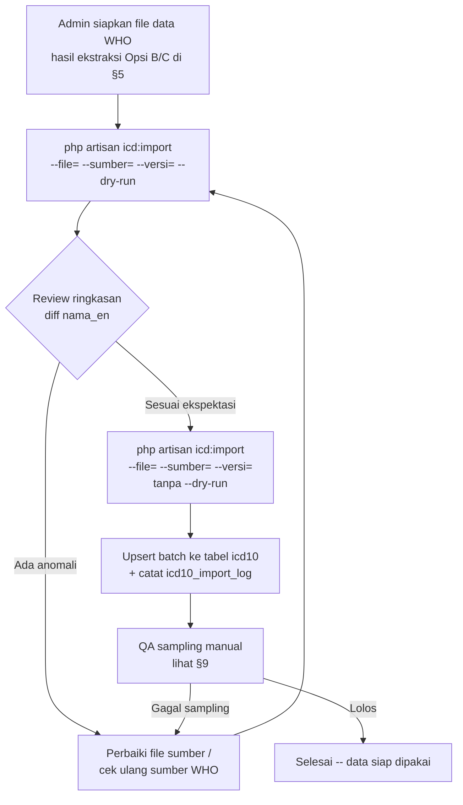

# Product Requirements Document (PRD)
# Seeder Data Diagnosa ICD-10 — Bahasa Inggris Resmi WHO

| Info | Detail |
|:-----|:-------|
| **Versi** | 1.0.0 |
| **Tanggal** | 25 Agustus 2026 |
| **Status** | Draft |
| **Depends On** | `pemeriksaan_soap.md` · `cetak_surat_pemeriksaan.md` (Resume Medis bilingual) |
| **Tech Stack** | Laravel 12 · Artisan Console Command · MySQL |
| **Scope** | Tabel `icd10`, command `icd:import`, setting `klinik.bahasa_icd` |

---

## Daftar Isi

1. [Ringkasan Eksekutif](#1-ringkasan-eksekutif)
2. [Latar Belakang](#2-latar-belakang)
3. [Kondisi Saat Ini (As-Is)](#3-kondisi-saat-ini-as-is)
4. [Tujuan & Non-Tujuan](#4-tujuan--non-tujuan)
5. [Sumber Data WHO ICD-10](#5-sumber-data-who-icd-10)
6. [Perubahan Skema Data](#6-perubahan-skema-data)
7. [Functional Requirements](#7-functional-requirements)
8. [Alur Proses Import](#8-alur-proses-import)
9. [Validasi & QA Data](#9-validasi--qa-data)
10. [Non-Functional Requirements](#10-non-functional-requirements)
11. [Fase Implementasi](#11-fase-implementasi)
12. [Acceptance Criteria](#12-acceptance-criteria)
13. [Risiko & Mitigasi](#13-risiko--mitigasi)
14. [Referensi](#14-referensi)

---

## 1. Ringkasan Eksekutif

Klinik butuh data diagnosa ICD-10 versi Bahasa Inggris yang **bisa dipertanggungjawabkan sumbernya langsung dari WHO** — bukan sekadar teks Inggris apa adanya. Ini penting karena kolom `nama_en` dipakai langsung di dokumen resmi lintas bahasa (Resume Medis untuk keperluan asuransi/perjalanan, lihat `cetak_surat_pemeriksaan.md`) yang bisa dibaca oleh pihak asuransi/otoritas di luar negeri — istilah medis yang tidak persis sama dengan terminologi resmi WHO berisiko menimbulkan keraguan validitas dokumen.

Database saat ini **sudah** berisi 10.480 kode ICD-10 dengan kolom `nama_en` terisi untuk 10.469 di antaranya (99,9%) — tapi **provenance-nya tidak terdokumentasi**: tidak ada catatan versi/edisi WHO, tanggal rilis, atau proses verifikasi yang dipakai saat data ini pertama kali diimpor lewat `master_icd_x.json`. PRD ini merancang proses untuk (a) menetapkan & mendokumentasikan sumber WHO resmi yang dipakai, (b) memverifikasi/mengganti `nama_en` dengan teks yang tertelusur ke sumber tersebut, (c) melengkapi `kategori` (bab/chapter WHO) yang saat ini nyaris kosong, dan (d) membangun proses impor yang bisa diulang & di-audit untuk update rilis WHO berikutnya.

---

## 2. Latar Belakang

- Modul SOAP Note (`app/Livewire/Pemeriksaan/SoapNote.php`) memakai `IcdDiagnosis::search()` untuk autocomplete diagnosa saat dokter mengisi Assessment.
- Modul Resume Medis (Cetak Surat, lihat `cetak_surat_pemeriksaan.md`) mendukung 2 bahasa (`id`/`en`) dan menampilkan diagnosa dalam bahasa yang dipilih — nilainya diambil dari snapshot `icd_codes` di `soap_note.icd_codes`, yang pada gilirannya diisi dari `nama`/`nama_en` tabel `icd10` saat dokter memilih diagnosa.
- `klinik.bahasa_icd` adalah setting global (`id`/`en`) yang menentukan kolom `nama` mana yang dipakai sebagai tampilan default di pencarian ICD (lihat `IcdDiagnosis::bahasaAktif()`).
- Infrastruktur impor sudah ada: `app/Console/Commands/ImportIcd10.php` (`php artisan icd:import`) membaca `master_icd_x.json` berformat `{kode_icd, nama_icd, nama_icd_indo}` dan melakukan upsert batch ke tabel `icd10`. Command ini **sudah dipakai** untuk mengisi data yang ada sekarang.
- Yang **belum ada**: dokumentasi dari mana `master_icd_x.json` yang sekarang berasal, versi ICD-10 WHO yang dirujuk, dan mekanisme untuk memverifikasi/memperbarui data itu terhadap sumber WHO resmi kalau ada revisi.

---

## 3. Kondisi Saat Ini (As-Is)

Hasil pengecekan langsung ke database lokal per tanggal dokumen ini dibuat:

| Metrik | Nilai |
|---|---|
| Total baris `icd10` | 10.480 |
| Baris dengan `nama_en` terisi | 10.469 (99,9%) |
| Baris dengan `nama_id` terisi | 10.469 (99,9%) |
| Baris dengan `kategori` (bab WHO) terisi | 11 (0,1%) |
| `klinik.bahasa_icd` saat ini | `id` |
| `master_icd_x.json` di root project | Ada, sumber/versi tidak terdokumentasi |

Contoh data existing (kolom `nama_en` sekilas terlihat wajar, tapi belum diverifikasi terhadap sumber WHO):

| kode | nama_id | nama_en |
|---|---|---|
| A09 | Diare dan gastroenteritis oleh penyebab penyakit menular | Diarrhoea and gastroenteritis of presumed infectious origin |
| A15.3 | TBC paru-paru, yang dikonfirmasi dengan cara yang tidak spesifik | Tuberculosis of lung, confirmed by unspecified means |
| A37.9 | Batuk rejan, tidak spesifik | Whooping cough, unspecified |

**Catatan penting**: contoh di atas memakai ejaan British ("Diarrhoea") yang konsisten dengan gaya penulisan WHO — indikasi bagus bahwa sumber aslinya memang berbasis materi WHO — tapi ini **asumsi, bukan verifikasi**. Fase QA (§9) di PRD ini secara eksplisit memvalidasi hipotesis ini alih-alih menerimanya begitu saja.

Selain itu, ada `database/seeders/Icd10Seeder.php` — seeder fallback terpisah berisi ~120 kode kurasi manual (Bahasa Indonesia saja, **tanpa** `nama_en`), dipakai `update.sh` hanya kalau tabel `icd10` kosong (instalasi baru). Seeder ini **tidak tersentuh** oleh PRD ini karena perannya cuma bootstrap darurat, bukan sumber data utama.

---

## 4. Tujuan & Non-Tujuan

### 4.1 Tujuan
- **G1**: Menetapkan & mendokumentasikan satu sumber data ICD-10 Bahasa Inggris yang tertelusur langsung ke publikasi resmi WHO (versi/edisi dicatat eksplisit).
- **G2**: Memverifikasi (atau mengganti bila perlu) `nama_en` seluruh 10.480 baris supaya sesuai istilah resmi WHO tersebut.
- **G3**: Mengisi `kategori` (bab/chapter WHO, mis. "I Certain infectious and parasitic diseases (A00-B99)") yang saat ini nyaris kosong, supaya pencarian/filter ICD-10 bisa dikelompokkan per bab.
- **G4**: Membuat proses impor **berulang & terlacak** (idempotent, tercatat versi & tanggal impor) supaya update rilis WHO berikutnya bisa dilakukan tanpa menulis ulang command dari nol.
- **G5**: Tidak mengubah `kode` ICD-10 yang sudah dipakai di data transaksional (`soap_note.icd_codes`, `surat_keterangan.data`) — hanya memperbarui teks label (`nama`/`nama_en`/`nama_id`) dan metadata (`kategori`).

### 4.2 Non-Tujuan (Out of Scope)
- **Tidak** migrasi ke ICD-11 — klinik masih memakai ICD-10 sesuai standar Kemenkes/BPJS yang berlaku saat ini.
- **Tidak** membangun UI admin untuk edit manual per-baris ICD-10 di aplikasi (proses impor tetap lewat Artisan command, konsisten dengan pola yang sudah ada).
- **Tidak** mengubah `Icd10Seeder.php` (seeder fallback kurasi manual) — tetap seperti sekarang, hanya dipakai untuk instalasi baru sebelum `icd:import` dijalankan.
- **Tidak** menyediakan sinkronisasi otomatis/berkala ke WHO (mis. cron bulanan) — proses impor tetap manual, dipicu admin saat memang ada rilis baru dari WHO.

---

## 5. Sumber Data WHO ICD-10

**⚠️ Perlu konfirmasi sebelum implementasi dimulai** — bagian ini memetakan opsi yang realistis berdasarkan struktur akses WHO yang berlaku umum, tapi URL/format/lisensi pastinya harus dikonfirmasi langsung ke situs WHO saat implementasi (kemungkinan berubah dari waktu ke waktu, dan sebagian akses butuh registrasi akun).

| Opsi | Deskripsi | Kelebihan | Kekurangan |
|---|---|---|---|
| **A. WHO ICD API** (`icd.who.int/icdapi`) | REST API resmi WHO, butuh registrasi gratis untuk dapat `client_id`/`client_secret` (OAuth2 client-credentials). API ini melayani ICD-11 sebagai fokus utama; ketersediaan *linearization* ICD-10 di dalamnya **perlu dicek ulang** saat implementasi — dokumentasi API bisa berubah. | Terstruktur, bisa diprogram, resmi WHO | Perlu registrasi; cakupan ICD-10 di API ini belum terverifikasi otomatis lewat pengecekan awal PRD ini |
| **B. WHO ICD-10 Online Browser** (`icd.who.int/browse10/2019/en`) | Versi tabular ICD-10 edisi 2019 yang WHO tampilkan online, dipakai sebagai rujukan pencarian per-kode. | Otoritatif untuk verifikasi manual per-kode | Bukan bulk-download — cocok untuk QA spot-check (§9), bukan sumber data massal |
| **C. WHO ICD-10 Instruction Manual & Volume 1 (Tabular List)** — PDF resmi WHO | Dokumen resmi berisi seluruh kode & deskripsi per bab, biasa jadi acuan definitif untuk proyek yang butuh data lengkap offline. | Otoritatif, mencakup struktur bab (untuk §7 kebutuhan `kategori`) | Format PDF — perlu proses ekstraksi/parsing terpisah, bukan file terstruktur siap-pakai |
| **D. Re-verifikasi `master_icd_x.json` yang sudah ada** | Anggap data existing sudah benar (karena polanya konsisten dengan gaya WHO), fokus verifikasi lewat sampling terhadap Opsi B, bukan re-import total dari nol. | Paling cepat & rendah risiko — tidak perlu proses ETL baru | Kalau ternyata sumber aslinya BUKAN WHO murni (mis. re-translasi/parafrase), cacatnya baru ketahuan belakangan |

**Rekomendasi tim implementasi**: mulai dari **Opsi D + Opsi B** (§9 QA sampling) sebagai langkah cepat berisiko rendah. Kalau sampling menemukan penyimpangan signifikan dari istilah resmi WHO, baru eskalasi ke **Opsi C** (parsing Volume 1 resmi) sebagai sumber pengganti definitif. Opsi A (API) disiapkan sebagai jalur jangka panjang untuk update rilis mendatang, tapi bukan blocker rilis pertama PRD ini.

Siapa pun yang mengeksekusi PRD ini **wajib mencatat** sumber final yang benar-benar dipakai (URL, tanggal akses, versi/edisi) di `revisi_impor_icd10` (lihat §6) — supaya keputusan sumber data ini bisa diaudit di masa depan, tidak terulang seperti kondisi as-is sekarang yang tidak terdokumentasi.

---

## 6. Perubahan Skema Data

Tabel `icd10` saat ini (`kode`, `nama`, `nama_en`, `nama_id`, `kategori`) sudah cukup untuk menyimpan hasil akhirnya. Yang perlu ditambahkan adalah **metadata provenance**, supaya masalah "tidak terdokumentasi" di §3 tidak terulang untuk update berikutnya.

### 6.1 Migrasi baru: `icd10_import_log`
Tabel kecil terpisah (bukan menambah kolom ke `icd10`, supaya histori tiap kali command `icd:import` dijalankan tetap tersimpan, bukan cuma snapshot "sumber terakhir"):

```php
Schema::create('icd10_import_log', function (Blueprint $table) {
    $table->id();
    $table->string('sumber');           // mis. "WHO ICD-10 Volume 1 (2019 edition)"
    $table->string('sumber_url')->nullable();
    $table->string('versi_who')->nullable(); // mis. "2019"
    $table->string('mode');             // upsert | replace
    $table->unsignedInteger('jumlah_baris');
    $table->unsignedInteger('jumlah_baru');
    $table->unsignedInteger('jumlah_diperbarui');
    $table->foreignId('dijalankan_oleh')->nullable()->constrained('users')->nullOnDelete();
    $table->timestamps();
});
```

### 6.2 Kolom `kategori` di `icd10`
Sudah ada (`string(100) nullable`), tidak perlu migrasi baru — cuma perlu **diisi** dengan nama bab WHO (§7, FR-4). Format disarankan: `"I Certain infectious and parasitic diseases (A00-B99)"` — konsisten dengan penamaan resmi WHO per bab, supaya bisa dipakai langsung untuk grouping/filter di UI pencarian ICD nantinya kalau dibutuhkan.

---

## 7. Functional Requirements

| ID | Requirement | Prioritas |
|---|---|---|
| FR-1 | Sumber data WHO resmi yang dipakai (§5) dicatat eksplisit sebelum proses impor dijalankan — bukan cuma diasumsikan dari file yang sudah ada. | Wajib |
| FR-2 | `php artisan icd:import` diperluas: parameter `--sumber=` dan `--versi=` wajib diisi saat menjalankan mode yang akan menulis ke `icd10_import_log` (§6.1) — command menolak jalan tanpa parameter ini kalau data yang diimpor akan menimpa `nama_en`. | Wajib |
| FR-3 | Proses upsert **tidak mengubah `kode`** — kode yang sudah dipakai di `soap_note.icd_codes`/`surat_keterangan.data` (snapshot JSON, bukan FK) harus tetap bisa dicari lewat kode yang sama meskipun label `nama`/`nama_en` diperbarui. | Wajib |
| FR-4 | `kategori` diisi otomatis berdasarkan rentang kode (mapping 22 bab ICD-10: A00-B99, C00-D48, D50-D89, E00-E90, F00-F99, G00-G99, H00-H59, H60-H95, I00-I99, J00-J99, K00-K93, L00-L99, M00-M99, N00-N99, O00-O99, P00-P96, Q00-Q99, R00-R99, S00-T98, V01-Y98, Z00-Z99, U00-U99) — bukan input manual per baris. | Wajib |
| FR-5 | Setelah import, `klinik.bahasa_icd` **tidak otomatis berubah** kecuali admin eksplisit memilihnya (beda dari command lama yang otomatis set `bahasa_icd` berdasar `--lang`, lihat §11 Fase 2 untuk migrasi behavior ini). | Wajib |
| FR-6 | Command punya mode `--dry-run` — tampilkan ringkasan perubahan (berapa baris baru, berapa `nama_en` yang akan berubah dari nilai sebelumnya) tanpa benar-benar menulis ke database. | Direkomendasikan |
| FR-7 | Setelah import selesai, tersedia laporan diff sederhana (CLI table) khusus baris yang `nama_en`-nya berubah dari nilai lama ke nilai baru — memudahkan reviewer memeriksa dampak sebelum commit ke production. | Direkomendasikan |

---

## 8. Alur Proses Import



---

## 9. Validasi & QA Data

Karena sumber data existing belum terverifikasi (§3), QA di sini **wajib** dijalankan sebelum data dianggap final — baik untuk jalur "re-verifikasi data existing" (Opsi D) maupun "import baru" (Opsi C):

1. **Sampling acak**: ambil 50 kode ICD-10 acak dari tabel `icd10`, bandingkan `nama_en` satu-per-satu terhadap WHO ICD-10 Online Browser (§5 Opsi B). Target kecocokan ≥ 98% (toleransi selisih kapitalisasi/tanda baca minor, bukan selisih makna medis).
2. **Sampling kode yang benar-benar terpakai**: ambil seluruh kode ICD-10 yang sudah pernah dipakai di data transaksional klinik (`SELECT DISTINCT JSON_EXTRACT(icd_codes, ...) FROM soap_note`) — ini prioritas lebih tinggi dari sampling acak karena dampaknya langsung ke dokumen yang sudah/akan diterbitkan (Resume Medis, dst).
3. **Cek struktur kode**: pastikan tidak ada kode yang lolos format standar ICD-10 (`[A-Z][0-9]{2}(\.[0-9A-Z]{1,4})?`) — indikasi data kotor dari sumber.
4. **Cek duplikasi makna**: pastikan tidak ada dua `kode` berbeda dengan `nama_en` identik persis (indikasi data ter-mapping salah saat ekstraksi dari sumber).
5. Hasil QA (lolos/gagal + catatan) didokumentasikan di `icd10_import_log` lewat kolom bebas (bisa tambahan `catatan_qa` text nullable) atau minimal di commit message saat data final di-deploy.

---

## 10. Non-Functional Requirements

- **Idempotency**: menjalankan `icd:import` dua kali dengan sumber & file yang sama tidak boleh menghasilkan baris duplikat atau mengubah data (mengikuti pola `upsert` yang sudah ada di command saat ini).
- **Performa**: ~10.500 baris, proses batch 500 baris/query (pola existing) harus selesai dalam hitungan detik, bukan menit — sudah tervalidasi oleh implementasi `ImportIcd10.php` yang ada.
- **Tidak ada downtime**: proses import berjalan sebagai Artisan command manual (bukan migration otomatis saat deploy), dijalankan admin di luar jam sibuk kalau data berubah signifikan.
- **Reversible**: `icd10_import_log` menyimpan cukup informasi untuk tim tahu kapan & dari sumber apa suatu batch data masuk, memudahkan investigasi kalau ditemukan masalah setelah rilis.
- **Tidak mengubah kontrak data existing**: kolom `icd_codes` (JSON snapshot di `soap_note`/`surat_keterangan`) tetap menyimpan `kode`+`nama` apa adanya di titik waktu pemeriksaan — perubahan `nama_en` di tabel master `icd10` **tidak** retroaktif mengubah dokumen yang sudah diterbitkan (ini sudah behavior existing karena snapshot, bukan referensi live — cukup dipastikan tidak berubah, bukan dibangun ulang).

---

## 11. Fase Implementasi

| Fase | Cakupan |
|---|---|
| **Fase 1 — Sumber & Verifikasi** | Tetapkan sumber final (§5), jalankan QA sampling (§9) terhadap data existing. Kalau lolos ambang batas 98%, lanjut Fase 2 tanpa re-import total. Kalau tidak lolos, siapkan file data baru dari sumber definitif (Opsi C) dan proses sebagai import baru. |
| **Fase 2 — Perluasan Command & Migrasi Kecil** | Migrasi `icd10_import_log`. Tambah parameter `--sumber`, `--versi`, `--dry-run` ke `icd:import` (FR-2, FR-6, FR-7). Ubah behavior "auto-set `bahasa_icd`" jadi eksplisit (FR-5) — perlu dicek dulu apakah ada dependency lain yang mengandalkan behavior lama ini. |
| **Fase 3 — Pengisian Kategori (Bab WHO)** | Implementasi mapping rentang kode → nama bab (FR-4), jalankan sebagai proses terpisah/idempotent (bisa backfill tanpa menyentuh `nama`/`nama_en`). |
| **Fase 4 — Eksekusi & QA Final** | Jalankan `icd:import` dengan `--dry-run` dulu, review diff, lalu eksekusi final di lokal → staging (kalau ada) → production (VPS, lewat `update.sh` atau manual sesuai kebutuhan sekali-jalan ini). |
| **Fase 5 — Dokumentasi** | Update PRD ini dengan sumber final yang benar-benar dipakai (isi §5 dengan keputusan aktual, bukan opsi), catat di `README`/`CHANGELOG` kalau proyek punya. |

---

## 12. Acceptance Criteria

- [ ] Sumber WHO resmi final tercatat eksplisit (URL/dokumen + versi/edisi) di §5 PRD ini dan di `icd10_import_log`.
- [ ] ≥ 98% sampel 50 kode acak (§9.1) cocok dengan WHO ICD-10 Online Browser.
- [ ] 100% kode yang sudah pernah dipakai di data transaksional klinik (§9.2) sudah diverifikasi cocok terhadap sumber WHO.
- [ ] Kolom `kategori` terisi untuk seluruh 10.480+ baris (naik dari 11 baris saat ini) sesuai mapping bab WHO.
- [ ] `php artisan icd:import` menolak berjalan menimpa `nama_en` tanpa parameter `--sumber` & `--versi`.
- [ ] `php artisan icd:import --dry-run` menampilkan ringkasan perubahan tanpa menulis ke database (diverifikasi: baris di `icd10` tidak berubah setelah dry-run).
- [ ] Menjalankan `icd:import` dua kali berturut-turut dengan file & sumber sama tidak menghasilkan baris duplikat (idempotent).
- [ ] Kode ICD-10 yang sudah dipakai di `soap_note.icd_codes`/`surat_keterangan.data` existing tetap bisa ditemukan lewat pencarian (`IcdDiagnosis::search()`) setelah import — tidak ada kode yang hilang/berubah.
- [ ] Regression test otomatis untuk `IcdDiagnosis::search()` dan alur pilih-diagnosa di SOAP Note (`tests/Feature/...`) tetap lolos setelah data diperbarui.

---

## 13. Risiko & Mitigasi

| Risiko | Mitigasi |
|---|---|
| Sumber WHO yang bisa diakses ternyata butuh proses registrasi/approval yang makan waktu (Opsi A) | Fase 1 dimulai dari Opsi D+B (verifikasi data existing) yang tidak butuh registrasi apa pun — Opsi A/C cuma dipakai kalau memang perlu eskalasi |
| File PDF WHO (Opsi C) sulit di-parsing otomatis jadi data terstruktur | Kalau eskalasi ke Opsi C diperlukan, ekstraksi dilakukan semi-manual per bab (22 bab, bukan per-kode) — beban kerja realistis untuk satu kali proses |
| `nama_en` existing ternyata hasil terjemahan mesin, bukan teks resmi WHO — butuh re-import total | §9 QA sampling dirancang untuk mendeteksi ini SEBELUM Fase 4 (eksekusi final), bukan sesudah rilis ke user |
| Perubahan `nama_en` massal membingungkan dokter yang sudah familiar dengan istilah lama | Perubahan hanya di label tampilan/pencarian, bukan kode — dan cakupannya ditata di Fase 4 sebagai satu rilis terjadwal, bukan perubahan diam-diam |
| Command `icd:import` yang diperluas (FR-2) merusak kompatibilitas dengan cara pemakaian lama di `update.sh` (STEP 5b, `Icd10Seeder`) | `Icd10Seeder` tidak disentuh (§4.2 non-tujuan) — parameter baru di `icd:import` sifatnya aditif (opsional kecuali saat akan overwrite `nama_en`), tidak mengubah command lama yang mungkin dipanggil di alur lain |
| Proses ini jadi pekerjaan satu kali lalu terlupakan sampai WHO merilis update ICD-10 berikutnya | `icd10_import_log` (§6.1) jadi jejak yang gampang dicek "terakhir update kapan & dari sumber apa" — cukup untuk keputusan manual kapan perlu di-refresh, tidak perlu otomatisasi cron (§4.2) |

---

## 14. Referensi

- `app/Console/Commands/ImportIcd10.php` — command existing yang jadi basis perluasan.
- `app/Models/IcdDiagnosis.php` — model & method `search()`/`bahasaAktif()`.
- `database/seeders/Icd10Seeder.php` — seeder fallback kurasi manual (tidak disentuh PRD ini).
- `database/migrations/2026_01_09_000001_create_icd10_table.php`, `2026_05_30_100001_alter_icd10_add_bilingual_columns.php` — skema existing.
- `prd/cetak_surat_pemeriksaan.md` — konteks pemakaian `nama_en` di dokumen Resume Medis bilingual.
- WHO ICD-10 Online Browser: `https://icd.who.int/browse10/2019/en` (rujukan verifikasi manual, §5 Opsi B).
- WHO ICD API: `https://icd.who.int/icdapi` (jalur jangka panjang, §5 Opsi A — URL/ketersediaan akses perlu dicek ulang saat implementasi).
